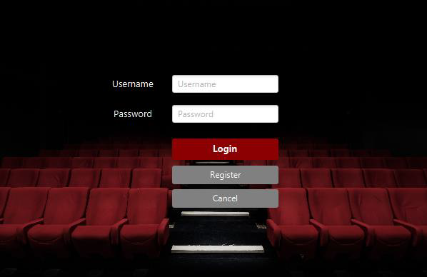
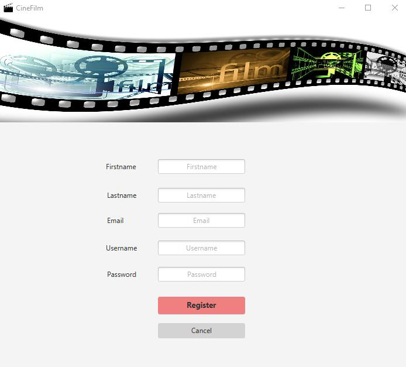
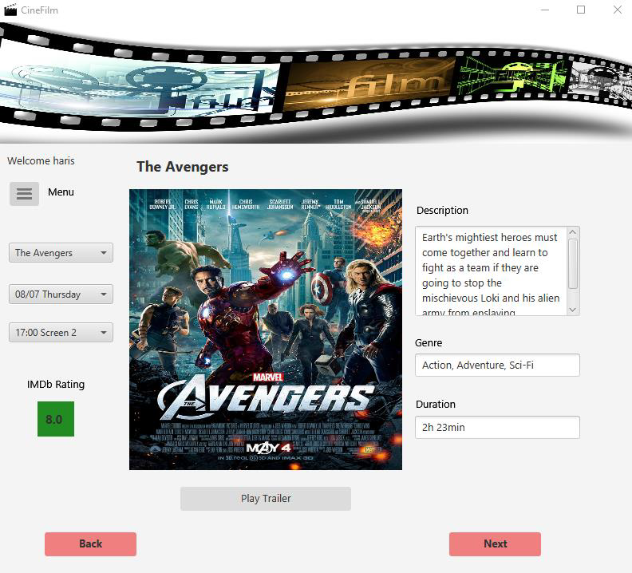
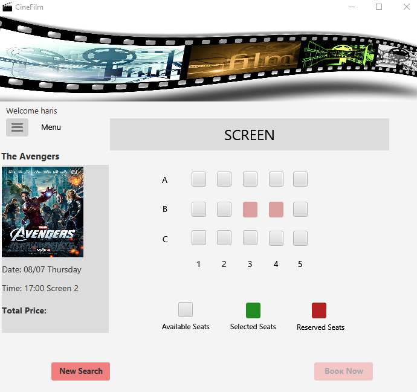
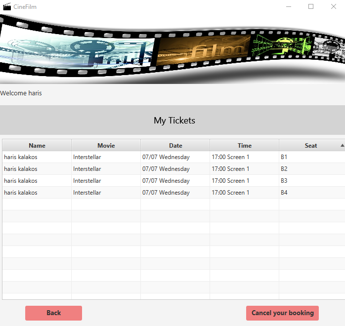
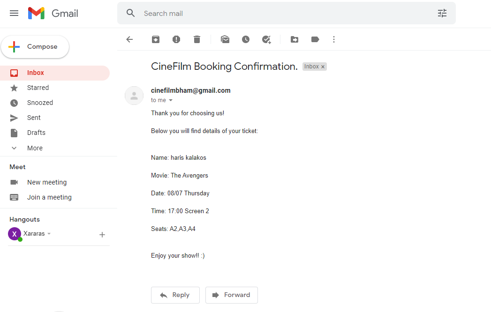
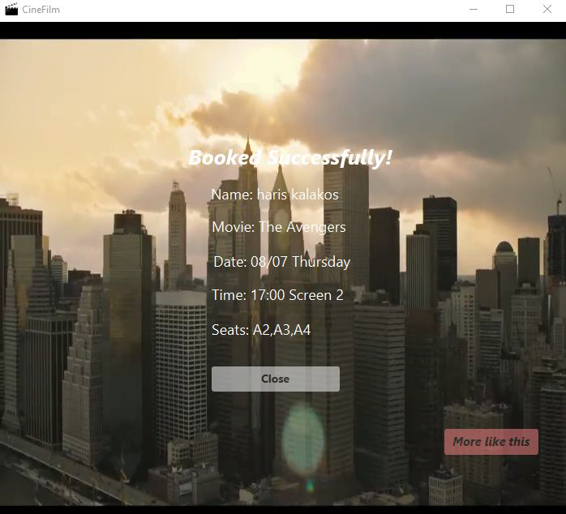
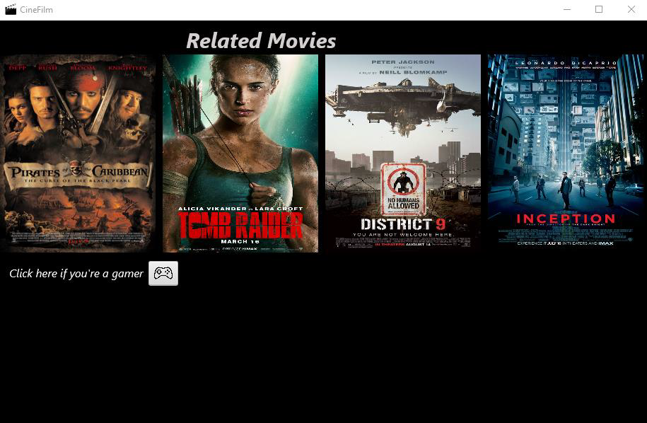
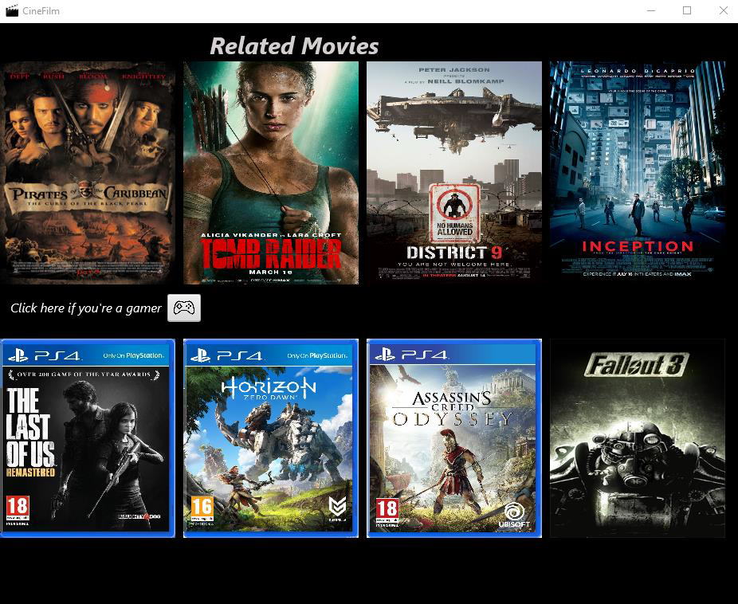

# Movie Booking System
### Master Thesis Project

#     
  
You need to have installed the following on your system:

✓ Java 1.8.0 and above
✓ PostgreSQL Database Management System

Then, follow these steps:

1. Download the zip file from [here](https://drive.google.com/file/d/1t2gXuFZifwNIxELysRjm8AI0L_EQw9o4/view?usp=sharing).
2. Extract the zip file. The content of the directory should be:

✓ Images folder
✓ Videos folder
✓ CineFilm.exe
✓ Database file

3. Import the Database file to the PostgreSQL Database Management System.

4. Run the CineFilm.exe file to start the Application.

*****Important note*****: Do not move the Images and Videos folders out of the CineFilm folder.
